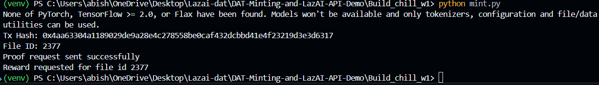

# Build_chill_w1 — mint.py

This README documents how to run `mint.py` (the DAT mint + proof request flow) and shows an example run (success). It also explains required environment variables and troubleshooting tips.

## What this script does

`mint.py` performs the following steps:

1. Encrypts a local text file (your privacy data) and uploads it to IPFS using Pinata.
2. Registers the uploaded file URL on the LazAI data registry (Mints a DAT or adds the file record).
3. Sends a proof request to a verified computing node to perform computation on the uploaded data.
4. Requests a DAT reward on-chain for the file.

## Prerequisites

- Python 3.8+ and a virtual environment
- The project virtualenv activated (recommended):

```powershell
# from repo root (Build_chill_w1)
python -m venv venv
venv\Scripts\Activate
```

- Install dependencies (use the project's `requirements.txt` or the packages below):

```powershell
pip install -r ..\requirements.txt
# or (if requirements.txt isn't present)
pip install alith python-dotenv rsa eth-account openai
```

- Required environment variables (set in PowerShell or in a `.env` file):

```powershell
$env:PRIVATE_KEY = "0x<your_wallet_private_key>"
$env:IPFS_JWT = "<your_pinata_jwt>"
# Optional: OPENAI/GROQ keys if you will run inference locally later
$env:OPENAI_API_KEY = "sk-..."
```

> Security: Keep your private key secret. Do not commit `.env` to version control. Prefer an ephemeral dev account for testing.

## How to run

From the `Build_chill_w1` folder with the virtualenv activated:

```powershell
python mint.py
```

### Expected output (example)

When the run succeeds you should see console output similar to the example below (this is taken from a successful run):

```
Tx Hash: 0xfaa2a00a210c7fee798196b6d0dce3edf71273a98e89e88a1eef8216a5530b5f
Proof request sent successfully
Reward requested for file id 2381
```

- `Tx Hash` — transaction hash for the on-chain action that registered or minted the file.
- `Proof request sent successfully` — the script posted the proof request to the verified node.
- `Reward requested for file id <n>` — the DAT reward request was triggered for the given file id.

## Screenshot

If you want to include a screenshot of the terminal output, save the image as `mint-success.png` inside this folder and it will show here in Markdown:



(Place the screenshot at: `Build_chill_w1/tnx.png`)

## Troubleshooting

- "The private key must be exactly 32 bytes long" or eth-account errors:
  - This means `PRIVATE_KEY` was not provided or formatted incorrectly. Ensure you set `PRIVATE_KEY` as a 0x-prefixed hex private key in your environment or `.env`.
  - Example (PowerShell):

```powershell
$env:PRIVATE_KEY = "0xabcdef0123456789..."
```

- Pinata upload errors: verify `IPFS_JWT` is correct and has the necessary permissions.

